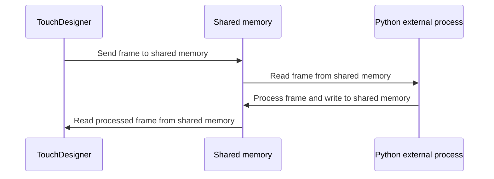

# YOLO video detection in the TouchDesigner

## Description

This project demonstrate how to use custom ML model in the TouchDesigner. The solution consists from two components:
1. Script TOP in the TouchDesigner.
2. External process to process data.




## Requirements

1. Python 3.9 or higher. It is more preferable to have same version as in the TouchDesigner.

## How to run

### Install prebuild package from PyPi

[](https://badge.fury.io/py/touch-designer-yolo-detection)

### From source

#### Install dependencies

For GPU:
```
pip install -r. /requirements.gpu.txt
```

For CPU:
```
pip install -r. /requirements.cpu.txt
```

For development:
```
pip install -r ./requirements.dev.txt
```

#### Compile Cython extension

[You need C compiler](https://docs.cython.org/en/latest/src/quickstart/install.html#installing-cython) to compile extension.

##### Develop mode
```
pip install -e .
```

##### Binary distribution

To compile binary distribution:
```
python -m cibuildwheel --platform <your_platform>
```

Install binary distribution:
```
pip install ./dist/*.whl
```

## Usecases

### Video detection
Run:
```
python ./main.py -c <checkpoint_path> -i <video_path> -o <video_path>
```

### With TouchDesigner

Run server processing:
```
python ./processing.py -p <path_to_model>
```

Open `touch_designer.py` in the TouchDesigner as script TOP.
